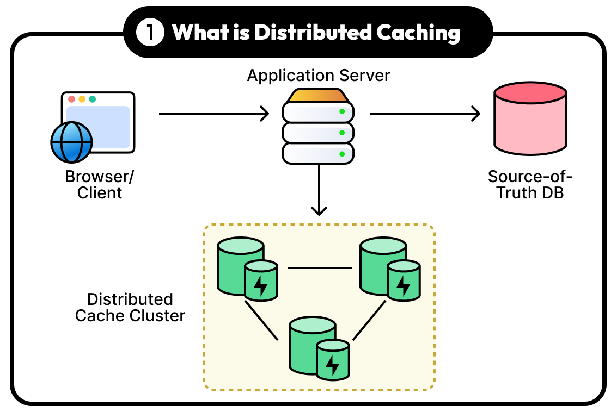

[Previous](../docs/missions.md) | [Homepage](../README.md) | [Valkey Keyspace Workshop: A Galactic Guide to Common Use Cases](../README.md)


# Mission 1️⃣: Hyperdrive Caching with Valkey Strings (20 minutes)


*"Punch it, Chewie!" - Making your app faster than light!*

## 🌟 What is Caching?
Caching is like having R2-D2's memory banks storing frequently accessed information close at hand for lightning-fast retrieval. Instead of calculating the hyperdrive coordinates every time, you store them for instant access when escaping Imperial forces.

**Why Cache?**
- **Speed**: Sub-millisecond data access vs. disk based database queries (100-1000x faster ⚡)
- **Efficiency**: Reduce database load like reducing strain on the hyperdrive
- **Scalability**: Handle more requests than a busy cantina (millions of ops/sec 📈)
- **Cost savings**: Reduce expensive database operations and infrastructure costs (save those credits 💸)
- **User experience**: Faster page loads = happier users (like satisfied cantina customers 😃)

#### Distributed Caching



> A distributed cache helps applications to improve performance and reliability by offloading requests for frequently access data from the source of truth to a low latency and high performance system designed for this purpose.

### The Challenge
The Rebel Alliance needs to cache Imperial fleet positions across multiple star systems. Every millisecond counts when outrunning TIE fighters!

### Solution: Use Valkey Strings Luke

Store data (plain string) using the [SET](https://valkey.io/commands/set/) command providing a Key `imperial_fleet:tatooine` and the Value `3 Star Destroyers, sector 7G` as well as the expiration in seconds (300) using the `EX` optional parameter.

Cache fleet positions with expiration (TTL in seconds) 📋

```bash
SET imperial_fleet:tatooine "3 Star Destroyers, sector 7G" EX 300
```

Response:
> OK

Retrieve cached data faster than R2-D2 accessing Death Star plans 📋

```bash
GET imperial_fleet:tatooine
```

Response:
> "3 Star Destroyers, sector 7G"

Check remaining TTL (Time To Live) 📋

```bash
TTL imperial_fleet:tatooine
```

Response (may differ from you):
> (integer) 290

Cache multiple systems 📋
```bash
SET imperial_fleet:hoth "1 Super Star Destroyer, 6 Star Destroyers" EX 600
```

Response:
> OK

Cache multiple systems 📋

```bash
SET imperial_fleet:endor "Shield generator station, 2 Star Destroyers" PX 300
```

Response:
> OK

Retrieve all fleet data 📋
```bash
GET imperial_fleet:tatooine
```

Response:
> "3 Star Destroyers, sector 7G"

Retrieve all fleet data 📋

```bash
GET imperial_fleet:hoth  
```

Response:
> "1 Super Star Destroyer, 6 Star Destroyers"

Retrieve all fleet data 📋

```bash
GET imperial_fleet:endor
```

Response:
> (nil)

What happened with Endor's data? Why did we get (nil)?

Let's check the TTL 
```bash
TTL imperial_fleet:tatooine
```

Response:
> (integer) -2

If you get a response `(integer) -2` means the `TTL` has expired, note the `PX` parameter in the `SET` command (this means _300 milliseconds_), by the time we try to read the data has already been expired from memory.

Beware of the duration of items in the Cache, sometimes you do want to evict them in less than a second, sometimes less than 1 minute, 1 hour or maybe exactly at midnight, for this you can specify TTL using the [EXPIRE](https://valkey.io/commands/expire/) or [EXPIREAT](https://valkey.io/commands/expireat/) command.

## ➡️ Next: [Explore Common Caching Patterns](../caching/deep-dive.md)

Attributions:

Images in this section are from the blog post [A Guide to Top Caching Strategies](https://blog.bytebytego.com/p/a-guide-to-top-caching-strategies) by ByteByteGo.
