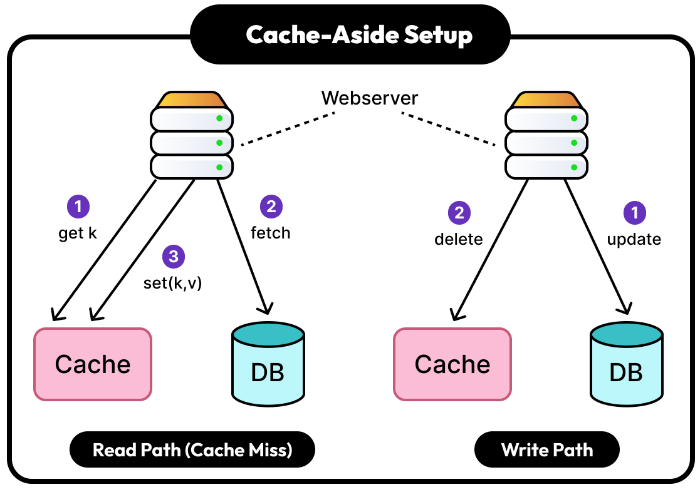
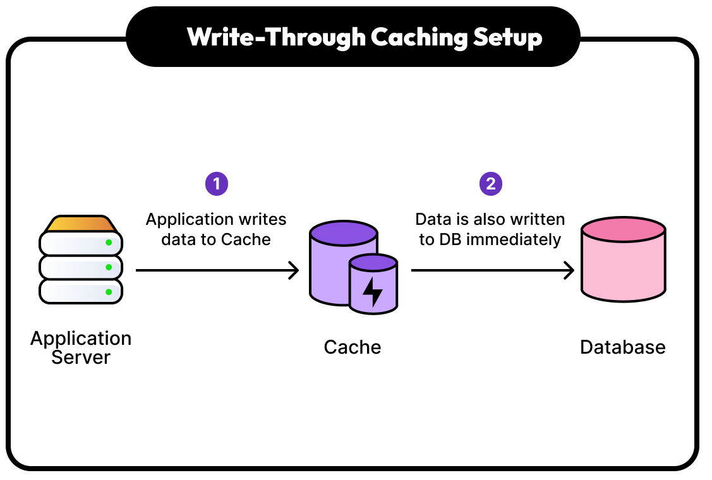
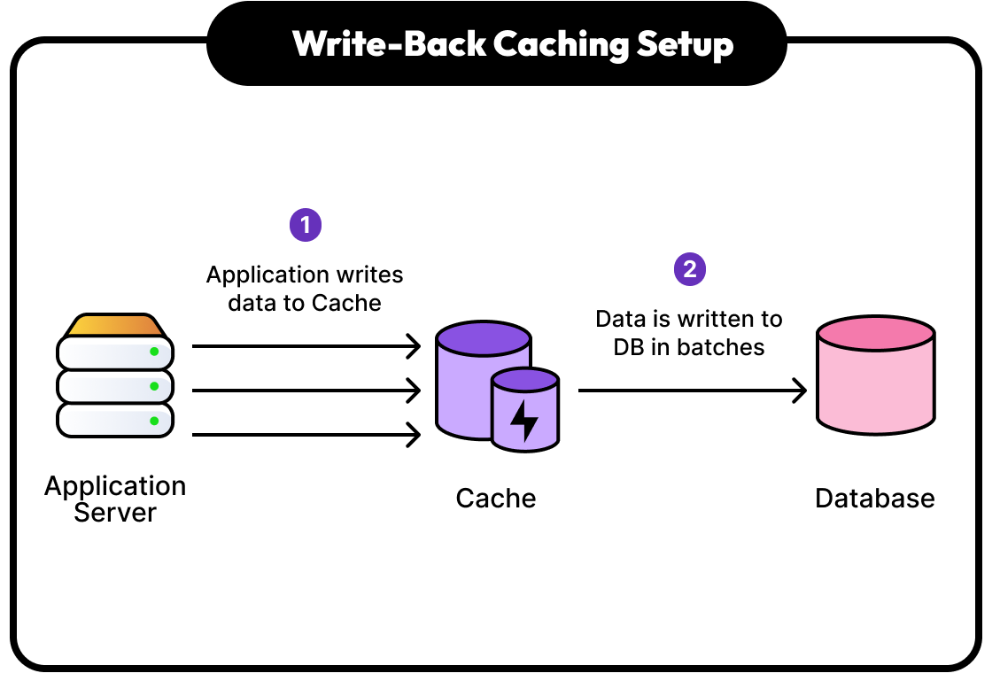
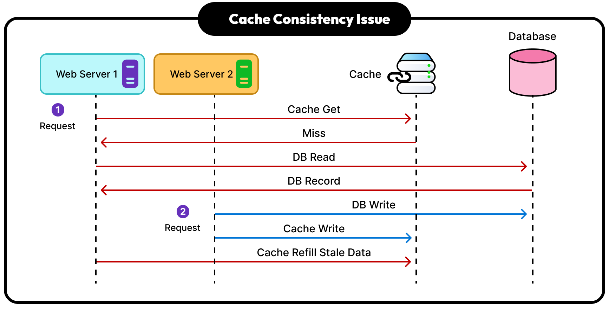

[Previous](../caching/README.md) | [Homepage](../../../README.md) | [Valkey Keyspace Workshop: A Galactic Guide to Common Use Cases](../../../README.md)


__Mission 1️⃣: Hyperdrive Caching with Strings__

# 🛸 Common Caching Patterns Deep Dive

Explore the different Caching mechanisms, pros, cons and caveats.

## **1. Cache-Aside (Lazy Loading)**

*"R2-D2 only loads Death Star plans when Luke actually needs them"*

**How it works:**
- Application checks cache first
- On cache miss ❌, fetch from database 💽
- Store result in cache ⚡ for next time
- Application manages all cache operations 🧠



**Best for:** Read-heavy workloads ♻️, unpredictable access patterns

__1. Check cache first__

```bash
GET death_star_plans:weakness_analysis
```

Response:
> (nil)

__2. Cache miss - fetch from "database" and cache result__

```bash
SET death_star_plans:weakness_analysis "Thermal exhaust port vulnerability confirmed" EX 3600
```

Response:
> OK

__3. Subsequent reads hit cache__

```bash
GET death_star_plans:weakness_analysis
```

**Pros:** ✅
- Only cache what's actually needed
- Cache failures don't break the application
- Data consistency is manageable

**Cons:** ❗ 
- Initial requests are slow (cache miss penalty)
- Application code complexity increases (Developers test as Jedi Masters)
- Potential for stale data (Like ancient languages that haven't been spoken for thousands of years)

---

## **2. Write-Through**

*"C-3PO updates both his memory banks and the central Rebel database simultaneously"*

**How it works:**

- Write to cache and database at the same time 🔄
- Every write operation updates both stores 🔃
- Reads always hit cache (if cache is available) 
- Strong consistency between cache and database 💪



**Best for:** Applications requiring data consistency, moderate write loads

Write-through simulation (application would handle database write)

__1. Update both cache and database in same operation__

```bash
SET rebel_base_location:hoth "Echo Base, coordinates 39.5991 N, 2.9238 E" EX 7200
```

Response:
> OK

__2. Reads are always fast and consistent__

```bash
GET rebel_base_location:hoth
```

Response:
> "Echo Base, coordinates 39.5991 N, 2.9238 E"

**Pros:** ✅
- Data consistency guaranteed
- Fast reads after writes
- Simple read logic

**Cons:** ❗
- Write latency increases (dual writes)
- Cache stores data that might never be read
- More complex failure handling

---

## **3. Write-Behind (Write-Back)**

*"Han Solo updates his pilot log in the Falcon's computer first, syncs with Rebel command later"*

**How it works:**

- Write to cache immediately
- Database write happens asynchronously later
- Fastest write performance
- Risk of data loss if cache fails before sync



**Best for:** Write-heavy applications, acceptable eventual consistency

__1. Write-behind pattern - immediate cache update__

```bash
SET pilot_log:han_solo "Completed Kessel Run in 12 parsecs" EX 1800
```

Response:
> OK

Application separately handles async database write

__2. Cache provides immediate read access__

```bash
GET pilot_log:han_solo
```

Response:
> "Completed Kessel Run in 12 parsecs"

**Pros:** ✅
- Fastest write performance
- Reduced database load
- Can batch database writes for efficiency

**Cons:** ❗
- Risk of data loss
- Complex consistency management
- Difficult error handling

---

## Two hard problems in computer science: Naming things and Cache invalidation



When multiple application servers are concurrently using the distributed Cache mechanism, an out of sequence error might occur, when dealing with shared resources it is important to acquire a lock in the Key that needs to be updated in order to prevent storing stale data after an update.

---

## ➡️ Next: [Test your skills with challenges](../caching/challenge.md)

Attributions:

Images in this section are from the blog post [A Guide to Top Caching Strategies](https://blog.bytebytego.com/p/a-guide-to-top-caching-strategies) by ByteByteGo.
