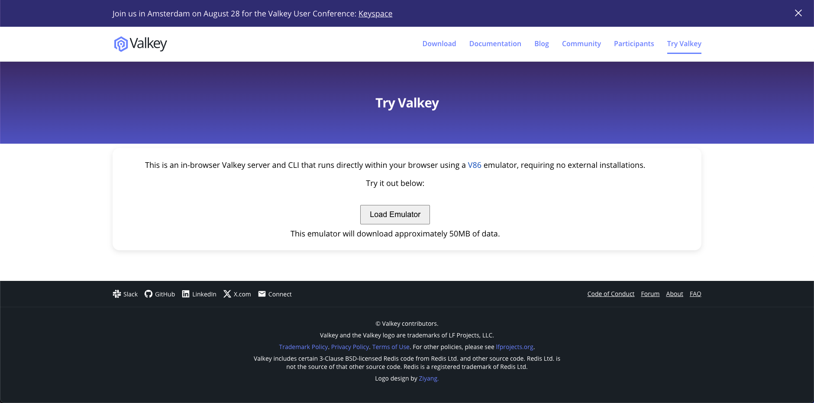
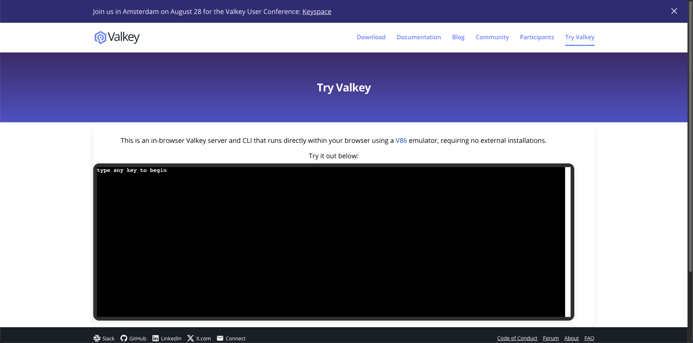

[Previous](../README.md) | [Homepage](../README.md) | [Valkey Keyspace Workshop: A Galactic Guide to Common Use Cases](../README.md)


# Practice on the flight simulator before going on hyperdrive (2 minutes)

For this workshop you do not need to install Valkey locally (although you are welcome to do so), instead you will be using an emulator running on your browser.

__Step 1__: Visit [Try Valkey](https://valkey.io/try-valkey/)



__Step 2__: Download Valkey by clicking on _Load Emulator_ button and wait for a few seconds while we redirect power to the Valkey engine.



__Step 3__: Type any key and you shall see the glorious `valkey-cli` console.


If you see a prompt with `127.0.0.1:6379` then you are ready to move forward. If you do not, ask one of workshop trainers for help.

> For your convenience we have split commands and responses and will have a clipboard icon 📋 every time you need to copy from this tutorial and paste into the browser.

Try a simple command 📋

```bash
INFO server
```

You should see a response like the following:

```bash
# Server`
redis_version:7.2.4
server_name:valkey
valkey_version:8.1.0
valkey_release_stage:ga
redis_git_sha1:00000000
redis_git_dirty:0
redis_build_id:3547a652f83cf433
server_mode:standalone
os:Linux 6.6.87-0-lts i686
arch_bits:32
monotonic_clock:POSIX clock_gettime
multiplexing_api:epoll
gcc_version:13.2.1
process_id:1285
process_supervised:no
run_id:7bef21f35eea8835da130777a7d92800df4fcbe5
tcp_port:6379
server_time_usec:1745308786940807
uptime_in_seconds:54
uptime_in_days:0
hz:10
configured_hz:10
clients_hz:10
lru_clock:478322
executable:/usr/local/bin/valkey-server
config_file:
io_threads_active:0
availability_zone:
listener0:name=tcp,bind=*,bind=-::*,port=6379
```

This means you are running `Valkey` version `8.1.0` on the browser.

## ➡️ Next: [Continue HERE to see the Missions details](../docs/missions.md)


